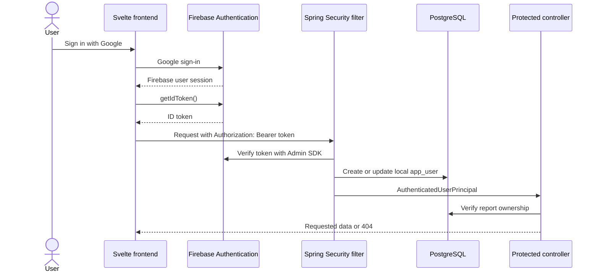

# ExtractAPI

ExtractAPI processes expense PDFs with a Svelte/Vite frontend, a Spring Boot API, and PostgreSQL. Authentication uses Google Sign-In through Firebase.

## Authentication flow



The frontend Firebase configuration identifies the Firebase project and is included in the browser build. It is not an administrative credential. The service-account file used by the backend is secret and must never be committed.

For each API call, the frontend obtains the current ID token through the Firebase Client SDK. The backend validates it, synchronizes the corresponding local user, and stores an `AuthenticatedUserPrincipal` in the request's `SecurityContext`. The application is stateless: the backend does not create an HTTP session, and the security context is discarded after the request.

`GET /api/auth/me` is a diagnostic endpoint that shows which user the backend authenticated. It does not create the Firebase session.

## Access rules

- `GET /terms` and CORS preflight requests are public.
- All other backend endpoints require a valid Firebase ID token.
- Creating a report records its owner using the authenticated local user ID.
- Reading a summary or exporting CSV requires ownership of that report.
- A missing report and another user's report both return `404 SESSION_NOT_FOUND`, avoiding disclosure that another user's session ID exists.
- Reports created before ownership tracking was introduced remain inaccessible until deliberately assigned.

The backend never accepts a frontend-provided user ID as proof of ownership. It obtains the local user ID from the validated principal.

## Local configuration

Prerequisites:

- Java 21
- Node.js and npm
- PostgreSQL
- A Firebase project with Google Sign-In enabled and `localhost` authorized

Copy `env.example` to `.env` and configure the database values plus the path to the Firebase service-account JSON. Also define these backend values if they are not already present:

```dotenv
GEMINI_API_KEY=
CORS_ALLOWED_ORIGIN=http://localhost:5173
FIREBASE_CREDENTIALS_PATH=./secrets/firebase-service-account.json
```

Copy `svelte-frontend/.env.example` to `svelte-frontend/.env` and fill in the Firebase web-app configuration. Variables beginning with `VITE_` are compiled into frontend JavaScript and must not contain secrets.

Keep the service-account JSON under `secrets/`. Both `.env` files and `secrets/` are ignored by Git.

Database schema changes are managed by Flyway. An empty database is initialized
from `javapi/src/main/resources/db/migration`, and an existing pre-Flyway
database must follow the controlled baseline procedure in
[`database/FLYWAY.md`](database/FLYWAY.md). Do not create or alter tables with
ad hoc scripts.

## Run locally

From the repository root, expose the service-account path to the Firebase Admin SDK and start the backend:

```powershell
$env:GOOGLE_APPLICATION_CREDENTIALS = (Resolve-Path .\secrets\firebase-service-account.json).Path
.\javapi\mvnw.cmd -f javapi\pom.xml spring-boot:run
```

In another terminal:

```powershell
cd svelte-frontend
npm install
npm run dev
```

The default development URLs are `http://localhost:5173` for the frontend and `http://localhost:9090` for the API.

Docker Compose reads backend values from the root `.env` and mounts the Firebase credential as a Docker secret:

```powershell
docker compose up --build
```

## Automated verification

Run all backend tests from the repository root:

```powershell
.\javapi\mvnw.cmd -f javapi\pom.xml test
```

Build the frontend:

```powershell
cd svelte-frontend
npm run build
```

Backend tests use mocks for Firebase verification and do not require a real service-account credential. They cover public and protected endpoints, missing and invalid tokens, valid authentication, local-user synchronization, and report ownership.

## Manual authentication checks

With the backend running, verify that the public endpoint works and the protected endpoint rejects missing or invalid credentials:

```powershell
curl.exe -i http://localhost:9090/terms
curl.exe -i http://localhost:9090/api/auth/me
curl.exe -i -H "Authorization: Bearer invalid-token" http://localhost:9090/api/auth/me
```

Then use the frontend to:

1. Sign in with Google and call `/api/auth/me`; confirm the backend returns the expected email and local user ID.
2. Generate a report and confirm an ownership row appears in `expense_report`.
3. Load and export that report with the same account.
4. Sign in with a different Google account and confirm the same session ID returns `404 SESSION_NOT_FOUND`.

Do not copy ID tokens into logs, screenshots, documentation, or Git. They are short-lived credentials even though they are visible to the browser that owns the Firebase session.
