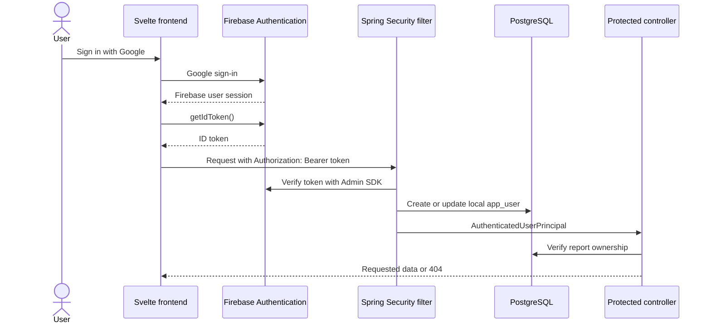

# ExtractAPI

ExtractAPI processes expense PDFs with a Svelte/Vite frontend, a Spring Boot API, and PostgreSQL. Authentication uses Google Sign-In through Firebase.

## Authentication flow



The frontend Firebase configuration identifies the Firebase project and is included in the browser build. It is not an administrative credential. The service-account file used by the backend is secret and must never be committed.

For each API call, the frontend obtains the current ID token through the Firebase Client SDK. The backend validates it, synchronizes the corresponding local user, and stores an `AuthenticatedUserPrincipal` in the request's `SecurityContext`. The application is stateless: the backend does not create an HTTP session, and the security context is discarded after the request.

`GET /api/auth/me` is a diagnostic endpoint that shows which user the backend authenticated. It does not create the Firebase session.

## Access rules

- `GET /terms`, `GET /actuator/health`, and CORS preflight requests are public.
- Report and account endpoints require a valid Firebase ID token.
- `POST /api/admin/email-notifications/{id}/resend` uses a separate admin API
  key because it is an operational endpoint, not a user endpoint.
- Creating a report records its owner using the authenticated local user ID.
- Reading a summary or exporting CSV requires ownership of that report.
- A missing report and another user's report both return `404 REPORT_NOT_FOUND`, avoiding disclosure that another user's report ID exists.
- Reports created before ownership tracking was introduced remain inaccessible until deliberately assigned.

The backend never accepts a frontend-provided user ID as proof of ownership. It obtains the local user ID from the validated principal.

## Local configuration

Prerequisites:

- Java 21
- Node.js and npm
- PostgreSQL
- A Firebase project with Google Sign-In enabled and `localhost` authorized

Copy `env.example` to `.env` and configure the database values plus the path to the Firebase service-account JSON. Also define these backend values if they are not already present:

```dotenv
GEMINI_API_KEY=
GEMINI_MODEL=gemini-3-flash-preview
GEMINI_TIMEOUT=3m
EXTERNAL_CALL_TIMEOUT=90s
CORS_ALLOWED_ORIGIN=http://localhost:5173
FIREBASE_CREDENTIALS_PATH=./secrets/firebase-service-account.json
```

Copy `svelte-frontend/.env.example` to `svelte-frontend/.env` and fill in the Firebase web-app configuration. Variables beginning with `VITE_` are compiled into frontend JavaScript and must not contain secrets.

Keep the service-account JSON under `secrets/`. Both `.env` files and `secrets/` are ignored by Git.
The backend validates required Gemini and admin-email settings during startup;
example placeholders and short API keys are rejected before workers start.

Database schema changes are managed by Flyway. An empty database is initialized
from `javapi/src/main/resources/db/migration`, and an existing pre-Flyway
database must follow the controlled baseline procedure in
[`database/FLYWAY.md`](database/FLYWAY.md). Do not create or alter tables with
ad hoc scripts.

## Run locally

From the repository root, expose the service-account path to the Firebase Admin SDK and start the backend:

```powershell
$env:GOOGLE_APPLICATION_CREDENTIALS = (Resolve-Path .\secrets\firebase-service-account.json).Path
.\javapi\mvnw.cmd -f javapi\pom.xml spring-boot:run
```

In another terminal:

```powershell
cd svelte-frontend
npm install
npm run dev
```

The default development URLs are `http://localhost:5173` for the frontend and `http://localhost:9090` for the API.

## Report API contracts

The frontend consumes the v2 report contract:

- `POST /v2/extract`
- `GET /v2/extract/summary/{reportId}`
- `GET /v2/extract/export/{reportId}`

V2 uses camelCase names such as `reportId`, `createdAt`, `expenses`,
`expenseGroups`, `categorySummaries`, and `highlights`. Category summaries
contain both `totalAmount` and `occurrenceCount`; expense dates are serialized
as ISO `yyyy-MM-dd`. A missing category remains `null`, and the frontend alone
applies the display label `Outros / Transferências`.

The former v1 report endpoints under `/extract` have been removed. The
unversioned `/extract/raw-text/` diagnostic utility remains available because
it is not part of the report contract.

## Durable classification workflow

Expense classification is asynchronous and uses PostgreSQL as a durable work
queue. Workers claim batches and tasks with `FOR UPDATE SKIP LOCKED`; leases
recover abandoned work, while status and attempt checks reject late worker
completions. Gemini calls run outside database transactions and have a
three-minute timeout. Other external calls use a 90-second timeout.

Automatic retries are bounded. The latest `FAILED` task blocks automatic task
recreation so a poison input cannot create an unbounded Gemini-call loop.
Terminal failures are intentionally inspected and corrected in the database by
an administrator; they are not exposed to users. Reports degrade to the public
`Outros / Transferências` fallback when no category is available.

Docker Compose reads backend values from the root `.env` and mounts the Firebase credential as a Docker secret:

```powershell
docker compose up --build
```

## Admin email reporting

The backend sends terminal classification alerts, a failure-only daily status
at 23:55, and a Saturday 08:00 weekly status. Schedules use
`America/Sao_Paulo` and are fixed in the application.

Copy the Gmail SMTP and admin-email variables from `env.example` into `.env`.
Set `SMTP_USERNAME` to the full Gmail address. For `SMTP_PASSWORD`, enable
2-Step Verification on that Google account and create a Google App Password;
do not use the account's normal password. Port 587 is configured with required
STARTTLS. `ADMIN_EMAIL_FROM` defaults to `SMTP_USERNAME` and should only be
overridden with a sender alias configured in Gmail. `ADMIN_EMAIL_RECIPIENTS`
accepts a comma-separated list. Keep `ADMIN_EMAIL_API_KEY` long, random, and
separate from the Google App Password.
The application refuses to start when the key is shorter than 32 characters or
still contains the example placeholder. SMTP connect, read, and write timeouts
default to 90 seconds.

To retry or resend one outbox notification, use the notification ID printed in
the email or permanent-failure log:

```powershell
curl.exe -i -X POST -H "X-Admin-API-Key: $env:ADMIN_EMAIL_API_KEY" http://localhost:9090/api/admin/email-notifications/42/resend
```

A failed notification gets a fresh retry budget, a pending notification is
made immediately eligible, and a delivered notification is copied into a new
outbox entry so its original audit record remains intact.

Email delivery is at-least-once: a process failure after SMTP accepts a message
but before the outbox marks it as sent may result in a duplicate. Notification
payloads are deduplicated by their originating classification failure.

## Automated verification

Run all backend tests from the repository root:

```powershell
.\javapi\mvnw.cmd -f javapi\pom.xml test
```

Docker must be available for the PostgreSQL/Testcontainers suite. Pull-request
and release workflows fail when that suite is absent or skipped, because it
validates Flyway, concurrent claims, leases, terminal retries, and the outbox
insert committed with a terminal failure.

Build the frontend:

```powershell
cd svelte-frontend
npm run build
```

Backend tests use mocks for Firebase verification and do not require a real service-account credential. They cover public and protected endpoints, missing and invalid tokens, valid authentication, local-user synchronization, and report ownership.

## Manual authentication checks

With the backend running, verify that the public endpoint works and the protected endpoint rejects missing or invalid credentials:

```powershell
curl.exe -i http://localhost:9090/terms
curl.exe -i http://localhost:9090/actuator/health
curl.exe -i http://localhost:9090/api/auth/me
curl.exe -i -H "Authorization: Bearer invalid-token" http://localhost:9090/api/auth/me
```

Then use the frontend to:

1. Sign in with Google and call `/api/auth/me`; confirm the backend returns the expected email and local user ID.
2. Generate a report and confirm an ownership row appears in `expense_report`.
3. Load and export that report with the same account.
4. Sign in with a different Google account and confirm the same report ID returns `404 REPORT_NOT_FOUND` from the v2 endpoint.

Do not copy ID tokens into logs, screenshots, documentation, or Git. They are short-lived credentials even though they are visible to the browser that owns the Firebase session.
