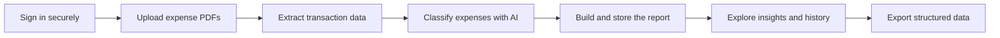

# ExtractAPI

ExtractAPI turns expense PDFs into clear, structured financial reports. Users can sign in, upload documents, review categorized spending, explore useful summaries, revisit previous reports, and export their data for further analysis.

The project combines document processing, AI-assisted classification, secure user access, and data visualization in a complete web application.

## How it works

Each report belongs to the account that created it. After the documents are processed, the application organizes expenses into consistent categories and presents totals, grouped spending, and practical highlights through an interactive interface.

## Main capabilities

- Google-based authentication and account-scoped reports
- Processing of multiple PDF expense documents
- Extraction and normalization of transaction data
- AI-assisted expense classification
- Spending summaries, category breakdowns, and report highlights
- Historical access to previously generated reports
- CSV export for use in spreadsheets and other tools
- Background processing designed to preserve work reliably
- Administrative notifications for important processing events

## Technology

### Frontend

- Svelte 5
- Vite
- Chart.js
- Firebase Authentication

### Backend

- Java 21
- Spring Boot and Spring Security
- Firebase Admin SDK
- Apache PDFBox
- Google Gemini
- OpenCSV

### Data and delivery

- PostgreSQL
- Flyway database migrations
- Docker
- Automated validation and deployment workflows

## Security and reliability

Authentication is verified by the backend, and report access is scoped to the authenticated owner. The application does not trust user identity supplied through ordinary request data.

Processing work is persisted so that temporary interruptions do not silently discard reports. External integrations are isolated from the core data flow, and failures are handled without exposing operational details to users.

## Engineering highlights

ExtractAPI demonstrates the design of a full-stack product that brings together secure authentication, PDF parsing, asynchronous processing, generative AI, relational data modeling, responsive visualization, automated testing, and containerized delivery.

The result is a practical user experience backed by an architecture designed for maintainability, traceability, and reliable data ownership.
